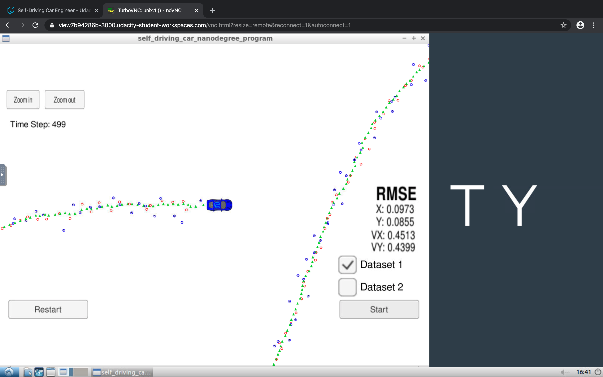

# Self-Driving Car Engineer Nanodegree Program

This project utilize a kalman filter to estimate the state of a moving object of interest with noisy lidar and radar measurements.

## Dependencies

* cmake >= 3.5
  * All OSes: [click here for installation instructions](https://cmake.org/install/)
* make >= 4.1 (Linux, Mac), 3.81 (Windows)
  * Linux: make is installed by default on most Linux distros
  * Mac: [install Xcode command line tools to get make](https://developer.apple.com/xcode/features/)
  * Windows: [Click here for installation instructions](http://gnuwin32.sourceforge.net/packages/make.htm)
* gcc/g++ >= 5.4
  * Linux: gcc / g++ is installed by default on most Linux distros
  * Mac: same deal as make - [install Xcode command line tools](https://developer.apple.com/xcode/features/)
  * Windows: recommend using [MinGW](http://www.mingw.org/)
* [uWebSocketIO](https://github.com/uWebSockets/uWebSockets)
  * Linux: run `./install_linux.sh` to install
  * Mac: run `./install_mac.sh` to install
* [Term 2 Simulator](https://github.com/udacity/self-driving-car-sim/releases)

## Protocol

Here is the main protocol that main.cpp uses for uWebSocketIO in communicating with the simulator.


**INPUT**: values provided by the simulator to the c++ program

``` python
["sensor_measurement"] => the measurement that the simulator observed (either lidar or radar)
```

**OUTPUT**: values provided by the c++ program to the simulator

``` python
["estimate_x"] <= kalman filter estimated position x

["estimate_y"] <= kalman filter estimated position y

["rmse_x"]

["rmse_y"]

["rmse_vx"]

["rmse_vy"]
```

## How to Build

From project root directory
```
mkdir build && cd build
make
```

## How to Run

From project root directory
```
./build/ExtendedKF
```
Open Term2 Simulator to connect to ths program via port `4567`.

### Performance


